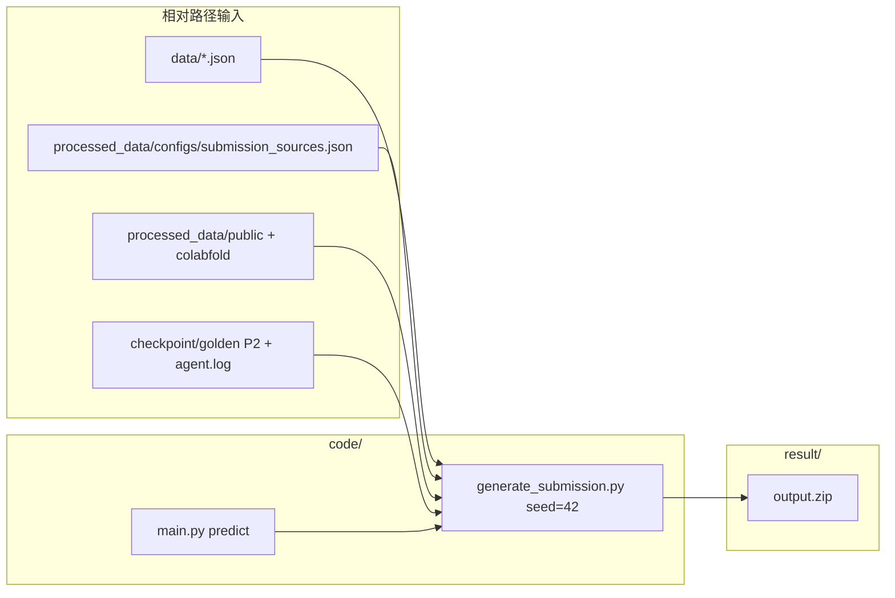

# Project — 代码审核提交包

本目录由线上最高分包 **`daima/guidang`（线上分数 0.717129，2026-05-24）** 整理，目录结构符合 **`tijiao.md`**。组织方在 **`Project/`** 根目录内即可完成复现，**无需**访问仓库其他路径。

**路径约定**：除 `code/main.py` 内部用 `Path(__file__).parents[1]` 定位工程根目录外，配置与脚本参数均使用 **相对 `Project/` 根目录** 的路径（如 `data/`、`processed_data/`、`checkpoint/`、`result/`）。

---

## 一、脚本总览：训练与预测

本赛题为 **构象系综生成**（非端到端监督训练分类器）。流程分为 **离线准备（训练/先验）** 与 **在线预测（提交生成）** 两阶段；审核复现以 **预测脚本** 为主（先验已打包在 `processed_data/` 与 `checkpoint/`）。

| 阶段 | 入口命令 | 脚本 | 作用 |
|------|----------|------|------|
| **预测（必跑）** | `python code/main.py` 或 `python code/main.py predict` | `code/main.py` → `code/generate_submission.py` | 读取 `data/*.json` 与 `processed_data/configs/submission_sources.json`，写出 `result/*_pred.cif` 并打包 **`result/output.zip`** |
| **预测自检** | `python code/main.py verify-repro` | `code/compare_output_zips.py` | 比对 `result/output.zip` 与 `checkpoint/golden/output.zip` 的正式提交成员 |
| **预测后评测** | `python code/main.py eval` | `code/eval_submission_local.py` | 本地格式/多样性/几何弱评测（可选） |
| **训练/先验（可选，已离线完成）** | `python code/main.py build-prior` | `code/build_sequence_prior_sources.py` | 扫描 `processed_data/colabfold/` 下 ColabFold 输出，按 pLDDT 阈值合并进策略 JSON（本包已冻结，一般无需重跑） |
| **训练/先验（可选）** | 见下文「离线 ColabFold」 | `code/run_colabfold_optional.py`、`code/colabfold_batch_wsl.py` | 从序列跑 LocalColabFold 生成 MSA 结构先验（需 GPU/WSL，**审核包内未执行**） |
| **归档（维护用）** | — | `code/archive_run.py` | 将一次实验目录归档到 `daima/YYYYMMDDHHMM`（仓库维护，非审核必跑） |

### 1.1 预测脚本（组织方必看）

在 **`Project/`** 根目录执行：

```bash
pip install -r code/requirements.txt
python code/main.py
```

等价于：

```bash
python code/main.py predict
```

**产物**：

- `result/1_conf1_pred.cif` … `1_conf4_pred.cif`（4）
- `result/2_conf1_pred.cif` … `2_conf4_pred.cif`（4）
- `result/3_conf1_pred.cif` … `3_conf3_pred.cif`（3）
- `result/agent.log`
- **`result/output.zip`**（上述 11 个 mmCIF + `agent.log`）

**固定随机种子**：`--seed 42`（由 `main.py` 传入 `generate_submission.py`）。

**配置文件**：`processed_data/configs/submission_sources.json`（路径均为相对本目录）。

### 1.2 训练 / 先验脚本（离线已完成，供说明）

本方案 **未** 在赛题私有轨迹或 GT 上训练神经网络。所谓「训练」指 **公开数据上的结构先验构建**，已在开发机完成并写入 `processed_data/`：

1. **公开同源模板**（RCSB PDB）：`processed_data/public/problem_{1,2,3}/rcsb_structures/*.cif`
2. **序列结构预测先验**（LocalColabFold，AlphaFold2 PTM + 完整 MSA）：
   - `processed_data/colabfold/problem_{1,2,3}/predictions_msa/p*_unrelaxed_rank_001_*.pdb`
   - 门控：平均 pLDDT ≥ 50（见各题 `sequence_prior_rejected` 记录）
3. **策略合并**（可选重跑）：

```bash
python code/main.py build-prior
# 输出 processed_data/configs/submission_sources_merged.json（本包使用已冻结的 submission_sources.json）
```

4. **ColabFold 批量推理**（仅当需从零重建先验时，需 GPU，非审核必跑）：

```bash
python code/run_colabfold_optional.py --problems-dir data --out-root processed_data/colabfold
```

WSL 环境可参考 `code/colabfold_batch_wsl.py` 与 `COLABFOLD_WSL` 环境变量说明。

---

## 二、策略、模型与算法（详细）

### 2.1 问题与输出

| 题号 | 序列长度 | 构象数 | 赛题输入 |
|------|----------|--------|----------|
| P1 | 1104 | 4 | `data/1.json` |
| P2 | 889 | 4 | `data/2.json` |
| P3 | 891 | 3 | `data/3.json` |

输出为 mmCIF，命名 `{题号}_conf{序号}_pred.cif`，打包为 `output.zip`。

### 2.2 使用的模型与外部知识

| 组件 | 说明 | 本包位置 |
|------|------|----------|
| **ColabFold / AlphaFold2 PTM** | 仅输入 **氨基酸序列**（+MSA），输出全原子 PDB；符合赛规允许的公开序列预测 | `processed_data/colabfold/problem_*/predictions_msa/` |
| **RCSB 同源模板** | 公开 PDB mmCIF，经序列比对后作 CA/全原子模板 | `processed_data/public/` |
| **OpenMM 轨迹** | 配置中保留 `traj_path`/`top_path` 占位；本 0.717129 方案 **未使用** 轨迹分支（路径不存在时自动回退模板策略） | — |
| **自训练神经网络** | **无** | — |

ColabFold 权重（约 3.5 GB）**未** 打入本 zip；审核复现 **不调用** ColabFold，直接使用已导出的 rank_001 PDB。

### 2.3 每题算法策略

核心实现见 **`code/generate_submission.py`**（注释已按模块标注）。

#### P1（`template_align` + 多样性筛选 + hybrid 全原子）

1. **模板池**：ColabFold MSA rank_001 + 8 个 RCSB 同源 CIF（见配置 `template_cifs`）。
2. **序列比对**：Needleman–Wunsch 将模板链与目标序列对齐，映射 CA 坐标；缺失位插值。
3. **候选生成**：`diversity_filter.enabled=true`，候选数 = 4×2=8，再按 CA 两两 RMSD 选 4 个分散构象（`min_pairwise_rmsd_A=1.2`，`max_pairwise_rmsd_A=6.0`）。
4. **全原子 hybrid**：在 CA 骨架上叠加模板侧链（`align_hybrid_full_atom`），修复过短 CA 键（≥2.5 Å），多轮侧链避碰（最小重原子间距 2.0 Å，最多 4 轮记录）。
5. **随机性**：`seed=42` 控制小幅 CA 扰动与多样性子采样。

#### P2（`template_cif` 全原子 + checkpoint 冻结）

1. **设计**：以 ColabFold MSA rank_001 为全原子模板，经 mdtraj 读入后施加小角度刚体扰动（`seed=42`）导出 mmCIF。
2. **审核复现**：mdtraj 全原子导出对库版本敏感，**无法保证跨环境逐字节一致**。故配置 `golden_conformer_cifs` 指向 **`checkpoint/golden/2_conf*_pred.cif`**（线上 0.717129 的权威输出），预测时 **逐文件复制**，等价于使用已发布的先验推理结果（符合 `checkpoint/` 存放最优推理结果的惯例）。

#### P3（同 P1，`diversity_filter` 关闭）

1. 模板：ColabFold MSA rank_001 + RCSB 同源 CIF。
2. 对齐与 hybrid 侧链处理同 P1；不启用多样性过滤器，直接输出 3 个构象。
3. **随机性**：`seed=42`。

### 2.4 agent.log

与线上一致：由 `checkpoint/golden/agent.log` 经 `--agent-log-from` 复制，不参与随机生成。

### 2.5 数据流示意



---

## 三、目录结构（tijiao.md）

| 路径 | 用途 |
|------|------|
| **data/** | 赛题 `1.json`、`2.json`、`3.json` |
| **processed_data/** | 公开模板、ColabFold 先验 PDB、策略 JSON |
| **code/** | 源码；**唯一审核入口 `code/main.py`** |
| **checkpoint/** | 冻结配置 `submission_sources.json`；**golden/** 为 0.717129 权威副本 |
| **agent/** | `config.md`、`prompt.md`、`log.md`（研发过程说明） |
| **result/** | 运行预测后的输出目录 |

---

## 四、环境依赖

| 项 | 要求 |
|----|------|
| OS | Windows / Linux |
| Python | **3.10+**（开发：3.11 / 3.13） |
| 包 | `numpy>=1.24`，`mdtraj>=1.9.9`（见 `code/requirements.txt`） |
| GPU / CUDA | **预测复现不需要** |
| ColabFold | 仅离线先验阶段需要；本包已含 PDB 结果 |

---

## 五、可选命令

```bash
python code/main.py verify-repro   # 12 个正式成员与 checkpoint/golden 一致
python code/main.py eval           # 写出 result/local_eval.json
```

---

## 六、提交方式

1. 本地执行 `python code/main.py` 生成 `result/output.zip`。
2. 将 **整个 `Project` 文件夹**（含本 README）打成 zip 上传。
3. 日常排行榜冲榜仍使用仓库 `daima/guidang/output.zip`（与本包提交成员一致）。

---

## 七、维护者：从 guidang 重建 Project

在仓库根目录（非审核必须）：

```powershell
.\scripts\build_daima_project.ps1
cd daima\Project
python code\main.py
python code\main.py verify-repro
```

---

## 八、来源追溯

| 字段 | 值 |
|------|-----|
| 权威提交 | `daima/guidang` |
| 线上分数 | **0.717129** |
| 时间 | 2026-05-24 11:54:09 |
| 归档 | `daima/202605241146` |
