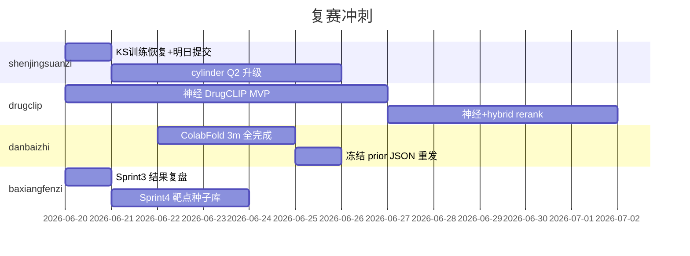

# 四赛道提交规划

> 更新：2026-06-19 | 复赛 z-score 取最高两赛道之和

## 今日提交额度 & 榜首差距

| 赛道 | 我方 best | 榜首 | 差距 | 今日剩余 | 优先级 |
|------|-----------|------|------|----------|--------|
| drugclip | 19.23 | **48.56** | −29.3 | **1** | P2（需神经路线，今日不浪费） |
| danbaizhi | 0.717 | **0.810** | −0.09 | **2** | P1 |
| baxiangfenzi | 0.670 | **0.888** | −0.22 | **1** | P1 |
| shenjingsuanzi | 42.09 | **181.15** | −139 | **0** | P0（明日） |

### shenjingsuanzi 榜首拆解（参考）

| 子项 | 榜首 | 我方（推断） | 差距 |
|------|------|-------------|------|
| KS_A | 11.61 | ~2.4 | ~9 |
| KS_B | 32.48 | ~0 | ~32 |
| cyl_A | 67.87 | ~20 | ~48 |
| cyl_B | 69.17 | ~20 | ~49 |

---

## 今日执行（2026-06-19）

### 1. baxiangfenzi — 用掉 1 次提交

**假设（Sprint3）：** 路线得分瓶颈在「只取第一条路线」；全枚举 + 更大搜索池可抬 composite。

| 变更 | 说明 |
|------|------|
| `enumerate_routes()` | 酰胺/ Suzuki / BRICS 全枚举，取 `score_route` 最高 |
| 两阶段选择 | dock 80 → composite 池 50 |
| Vina 3 modes | 取最佳 affinity |
| Docker | 300/80/50 候选池 |

```powershell
.\submit\publish_track.ps1 -Track baxiangfenzi -Note "Sprint3 route_enum two_stage"
# 天池提交 → 出分后归档
py -3 scripts/archive_competition.py --track baxiangfenzi --score <分> --note "Sprint3"
```

### 2. danbaizhi — 用掉 1～2 次提交

**假设：** P1 已有 `predictions_msa_3m` model_1+2（pLDDT~89）；`AUTO_PRIOR` + `max_prior=24` 可略抬 P1 多样性。

| 变更 | 说明 |
|------|------|
| `max_prior_per_problem` 8→24 | `build_sequence_prior_sources.py` |
| 镜像已含 ColabFold PDB | `COPY Project/` |

```powershell
.\submit\publish_track.ps1 -Track danbaizhi -Note "auto_prior max24 P1_3m"
# 提交 1：立即测 P1 增益
# 提交 2（可选）：等 P1 model_3 完成后重发
```

### 3. drugclip — **建议保留今日 1 次**

指纹路线天花板 **~19.23**（已追平 ReDrugClip 文档冠军）。榜首 **48.56** 需 **DrugCLIP 神经检索**（PyTorch + LMDB + 权重），预估 5–7 天 Sprint。

**今日动作：** 不提交；启动神经 MVP 开发（见 `TASKS/drugclip/EXPERIMENTS.md` Sprint 2）。

若必须提交：维持 pin `bb37aa2`，勿做 FP 微调（历史 ensemble 跌至 11.29）。

### 4. shenjingsuanzi — 今日 0 次，**明日首提**

**假设：** KS `fno1d_train` 恢复后 Q1 可从 2.4→10–40+；cylinder 仍 ~40（第二周冲刺）。

| 已就绪 | pin `a489387` + 本轮 logging |
|--------|------------------------------|
| 明日验证 log | `ks_train_candidate` 任一 `exists=True`；`ks_source=fno1d_train`；`ks_train_done` |

```powershell
.\submit\publish_track.ps1 -Track shenjingsuanzi -Note "KS train path logging"
# 明日 00:00 后提交
```

---

## 未来 7 天路线图



### shenjingsuanzi 分阶段目标

| 阶段 | 目标分 | 关键动作 |
|------|--------|----------|
| D+1 | 60–90 | KS FNO 真训练 + A/B 四文件 |
| D+3 | 100–130 | cylinder 容器内训练 / 更强 FNO |
| D+7 | 150+ | 对标榜首 181 需 Q2≈130+ |

### drugclip 分阶段目标

| 阶段 | 目标分 | 关键动作 |
|------|--------|----------|
| Sprint2 | 25–35 | `neural.py` + LMDB + `dude_identity_90.pt` |
| Sprint3 | 40–48 | RRF(neural, hybrid) + 10-conformer |

### danbaizhi 分阶段目标

| 阶段 | 目标分 | 关键动作 |
|------|--------|----------|
| 今 | 0.73–0.75 | P1 双 3m 模型 |
| ColabFold 完 | 0.78–0.81 | 9 模型 prior + `max_prior=24` |

### baxiangfenzi 分阶段目标

| 阶段 | 目标分 | 关键动作 |
|------|--------|----------|
| Sprint3 | 0.70–0.75 | 路线枚举（今日） |
| Sprint4 | 0.80+ | 靶点感知候选库 + 3-step 逆合成 |

---

## 用户每日操作

1. 更新 `STATUS/DAILY_STATUS.md`（分数、剩余次数）
2. 说「开始执行」→ AI 按本规划 publish + 提醒提交
3. 出分后：`py -3 scripts/archive_competition.py --track <名> --score <分>`
